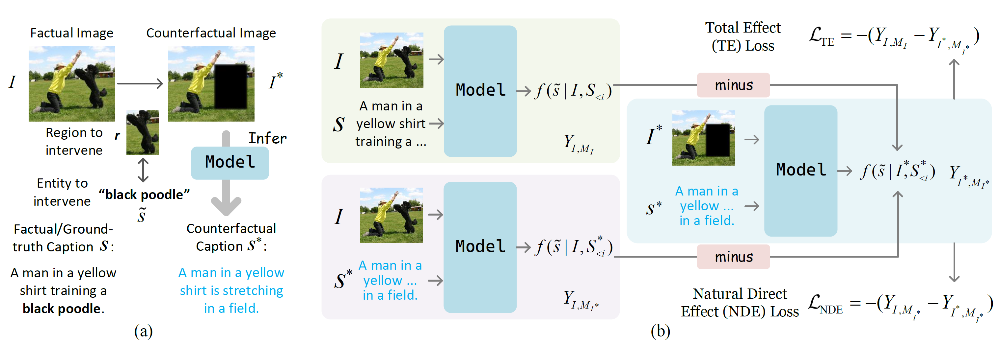
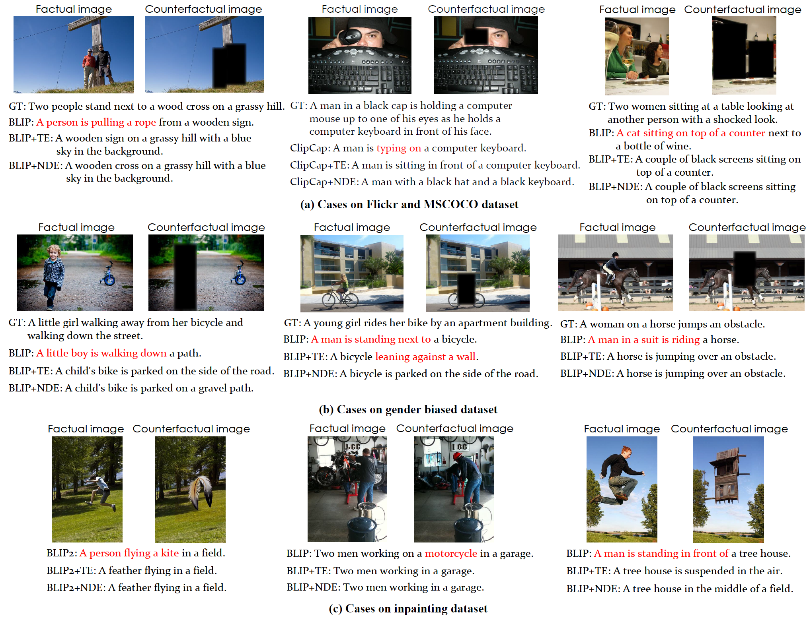

# See or Guess: Counterfactually Regularized Image Captioning

[](#Python)
[](#PyTorch)
[](#Transformers)
 


> This repository includes the original implementation of the paper **[See or Guess: Counterfactually Regularized Image Captioning]()** (ACM MM 2024) by Qian Cao et al.


# Abstract
In this work, we present a generic image captioning framework that employs causal inference to make existing models more capable of interventional tasks, and counterfactually explainable.
<details> 
<summary> More (Click me) </summary>
Our approach includes two variants leveraging either total effect or natural direct effect.
Integrating them into the training process enables models to handle counterfactual scenarios, increasing their generalizability.
Extensive experiments on various datasets show that our method effectively reduces hallucinations and improves the model's faithfulness to images, demonstrating high portability across both small-scale and large-scale image-to-text models.
</details><br>


<br>


If you find our work useful, please cite the paper:
```
@inproceedings{cao2024see,
    title={See or Guess: Counterfactually Regularized Image Captioning},
    author={Cao, Qian and Chen, Xu and Song, Ruihua and Wang, Xiting and Huang, Xinting and Ren, Yuchen},
    booktitle={ACM Multimedia 2024}
}
```


# Content
0. [Before Start](#before-start)
1. [Setup](#setup)
2. [Prepare the Data](#prepare-the-data)
3. [Usage](#usage)
4. [Contact](#contact)


# Before Start
- Our method can be applied to many small- or large-scale image-to-text models. We provide an implementation of BLIP2 in this repo.
- The implementation of BLIP2 is based on the original one in [LAVIS](https://github.com/salesforce/LAVIS). You can find more details [LAVIS/BLIP2](https://github.com/salesforce/LAVIS/tree/main/projects/blip2).


# Setup
Create a new virtual environment:
```
git clone https://github.com/Aman-4-Real/See-or-Guess
cd See-or-Guess/
conda create -n cfric python===3.9
conda activate cfric
```


# Prepare the Data
- Please organize your data as the following format:
```
{
    'img_path': 'val2014/COCO_val2014_000000522418.jpg', # relative image path in the dataset dir
    'caption': 'A woman wearing a net on her head cutting a cake. ', # string
    'phrases': [
        {
            'phrase': 'cake', # the noun phrase
            'boxes': [[x1, y1, x2, y2], ...], # bounding boxes of the noun phrase
            'first_word_index': 10 # the index of the first word of noun phrase appearing in the caption
        },
        ...
    ],
    'img_id': '522418' # unique image id
}
```
- Save the data into `.pkl` file and put it in the `YOUR_DATASET_DIR`.
- Change the `url` and `storage` fields in the file `src/lavis/configs/datasets/mscoco/defaults.yaml` to `YOUR_DATASET_DIR/{train,valid,test}.pkl`, correspondingly.


# Usage

### Quick Check Out
For the key implementation, refer to [cfr_caption_datasets.py](src/lavis/datasets/datasets/cfr_caption_datasets.py), [modeling_opt.py](src/lavis/transformers_v4p34_local/models/opt/modeling_opt.py) and [CFRLoss.py](src/lavis/transformers_v4p34_local/models/opt/CFRLoss.py)


### Prepare pretrained checkpoint
Download pretrained BLIP2 checkpoint (e.g., [blip2-opt-2.7b](https://huggingface.co/Salesforce/blip2-opt-2.7b)) to the `ckpt/` folder.


### Workflow
Generally speaking, our work is based on a trained image captioning model ("initial model" in the paper). You can follow the following steps:

1. Prepare or train the initial model
If you need to train the BLIP2 on your dataset, you can follow the instructions in the [LAVIS](https://github.com/salesforce/LAVIS) repo, or you can run 
```
cd src/run_scripts/
```
use the config `src/lavis/run_cfgs/caption_coco_ft.yaml`, run
```
bash train_caption.sh
```

2. Use the trained initial model to generate counterfactual captions on the training set. Use the config `src/lavis/run_cfgs/caption_eval_gen_on_train.yaml` and run
```
bash eval_caption.sh
```

3. Use the total effect loss (TE) or natural direct effect loss (NDE) to regularize the training. 
Use the config `src/lavis/run_cfgs/caption_coco_ft_te0999.yaml` for TE
```
bash train_caption.sh
```
and `src/lavis/run_cfgs/caption_coco_ft_nde0999.yaml` for NDE. Remember to set both `do_NDE` and `do_TE` to `True` while doing NDE training. Also adjust a proper value of hyperparameter α in the config.


### Evaluation
For evaluation, us the config `caption_coco_ft.yaml` (for factual image captioning) and `caption_coco_eval_mask_gen.yaml` (for counterfactual image captioning) for `src/run_scripts/eval_caption.sheval_caption.sh`.


### Cases Study

<br>


# Contact
For any questions, please feel free to reach me at caoqian4real[at]ruc.edu.cn.

